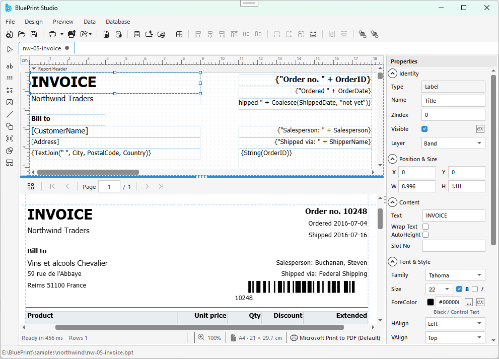
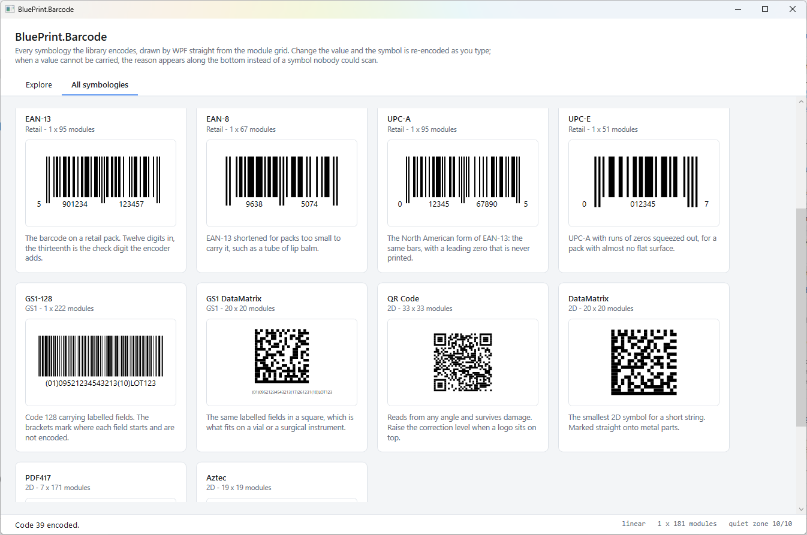
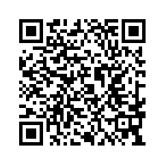

# BluePrint

Add reporting to your .NET application: design a report once, then render it to
PDF, Excel, HTML, a printer, or a live preview control inside your own WPF
application. Drop in `BluePrint.Render` to render existing `.bpt` reports, or add
`BluePrint.Designer` to let your users build and edit reports themselves, right
inside your app.

<p align="center">
  
</p>

*BluePrint Studio - the standalone designer built on the same `BluePrint.Designer`
control you can embed in your own application.*

This repository is where BluePrint is distributed and documented. It carries the
released binaries, the sample projects, and the place to report a problem.

## Document

Documentation with worked examples for reports, expressions, and data sources lives on the
[BluePrint wiki](https://github.com/bluecrafts/BluePrint/wiki).

## Packages

| Package | What it gives you |
| --- | --- |
| [`BlueCrafts.BluePrint.Render`](https://www.nuget.org/packages/BlueCrafts.BluePrint.Render) | the report engine: load a `.bpt` definition, export to PDF, Excel, HTML or print |
| [`BlueCrafts.BluePrint.Render.WPF`](https://www.nuget.org/packages/BlueCrafts.BluePrint.Render.WPF) | `BluePrintPreviewControl`, the on-screen preview for WPF |
| [`BlueCrafts.BluePrint.Designer`](https://www.nuget.org/packages/BlueCrafts.BluePrint.Designer) | `BluePrintDesignerControl`, an embeddable WPF report designer |
| [`BlueCrafts.BluePrint.Barcode`](https://www.nuget.org/packages/BlueCrafts.BluePrint.Barcode) | barcode and QR symbols, with no third party barcode dependency |

Each package depends on the one below it, so install only the package that
matches what you are building and the rest of the chain comes with it.

```
dotnet add package BlueCrafts.BluePrint.Render
```

| Package | Target framework |
| --- | --- |
| `BlueCrafts.BluePrint.Barcode`, `BlueCrafts.BluePrint.Render` | `net10.0` |
| `BlueCrafts.BluePrint.Render.WPF`, `BlueCrafts.BluePrint.Designer` | `net10.0-windows` with `<UseWPF>true</UseWPF>` |

Every package carries its own readme with a quick start, shown on its page on
nuget.org.

## BluePrint Studio

The standalone report designer ships as a binary, attached to each release. It
hosts the designer and the preview together, and reads and writes the same
`.bpt` files the libraries do.

## Barcodes

`BlueCrafts.BluePrint.Barcode` is the symbol generator the report engine uses,
and it stands on its own. There is no third party barcode library behind it, and
no graphics dependency at all until you ask for pixels.

| Family | Symbologies |
| --- | --- |
| Linear | Code 39, Code 128, ITF, Codabar |
| Retail | EAN-13, EAN-8, UPC-A, UPC-E |
| GS1 | GS1-128, GS1 DataMatrix |
| 2D | QR Code, DataMatrix, PDF417, Aztec |

Encoding returns a grid of modules with no unit attached to it, which you can
write straight out as SVG, or draw as a bitmap through `BluePrint.Barcode.Render`.
A value the symbology cannot carry comes back as a reason instead: a bad check
digit, a character outside its set, more data than it holds.

<p align="center">
  
</p>

*`Demo/Demo.Barcode.Wpf` - every symbology on screen, re-encoded as you type and
drawn as vector geometry by about a hundred lines of WPF.*

## Samples

`Demo/` holds small, self-contained projects: the smallest thing that renders a
report, the preview control in a WPF window, the designer embedded in a host
application, and two that use the barcode package on its own - one writing every
symbology out as SVG and PNG, one drawing them on screen with WPF. Each builds
against the published packages, so what you read is what you would write.

[`SampleReport/`](SampleReport/) holds finished `.bpt` report templates you can open
in Studio directly: five that need nothing at all, and twelve more built on the
classic Northwind database running from a single file with no server.

## Text rendering

Text measurement and line breaking use ICU. On Linux install `libicu` and set
`DOTNET_SYSTEM_GLOBALIZATION_INVARIANT=false`; on Alpine use `icu-libs` together
with `icu-data-full`, because `icu-data-en` omits the Thai dictionary.

## Getting help

| | |
| --- | --- |
| A bug in a published package or in Studio | open an issue |
| A security vulnerability | see `SECURITY.md` - do not open a public issue |
| Improving the docs or the samples | see `CONTRIBUTING.md` |

## Buy me a coffee

BluePrint is built and maintained independently, and everything here is free to use. If it saved you
an afternoon of work, you are welcome to buy me a coffee. It is a thank you, nothing more - any
amount is fine, and none of it unlocks anything.

The coffee fund runs on Bitcoin:



```
bc1q62zsxh2qmrsplpg4vu8lesev5y7hgjlra8v455
```

The QR code holds **exactly the address printed above** and nothing else - scan it, then check the
first and last few characters against the text before you send anything.

<br clear="left">

> **Warning: this page is the only official address.** We never send a donation address by email,
> chat, or issue comment, and we never ask you to send funds to a different address. If you see one
> anywhere else, it is not ours - come back here and check.

A coffee is a gift, not a purchase: it does not create a support contract, a warranty, or a promise
to build a particular feature. If you need any of those, get in touch about a commercial license.

## License

BluePrint is free to use, including for commercial work. Build it into your
applications, your internal tools, and the products and services you sell, and ship
it to your customers - no fee and no registration.

Only enterprises (annual revenue above USD 10 million, counting affiliates) need a
commercial license, and only for production use. Evaluation, development, and
testing stay free.

The full text is in `LICENSE.txt`, and a copy is included in every package.
Commercial licenses and questions: craftman@bluecrafts.co
